# 一、准备

## 1. 安装 node 环境

### 1.1 下载

官网下载地址：https://nodejs.org/zh-cn/download/，根据自己需要下载相应版本格式。

> `.msi`和`.zip`格式区别：
>
> - `.msi`是Windows installer开发出来的程序安装文件，它可以让你安装，修改，卸载你所安装的程序。说白了.msi就是Windows installer的数据包，把所有和安装文件相关的内容封装在一个包里。
> - `.zip`是一个压缩包，解压之后即可，不需要安装


### 1.2 解压、配置环境变量

解压zip包到安装目录，将解压后的node根目录路径添加到环境变量的path里面，如下：

~~~
变量名：Path
变量值：.....（之前其他程序路径）;C:\Applications\node-v12.16.1-win-x64;
~~~


### 1.3 检测是否安装成功

既然已经将`node`添加到全局系统变量，我们可以直接在`CMD`窗口中任意位置执行`node`，打开CMD窗口，执行命令 `node -v` 查看node版本；

最新版的node在安装时同时也安装了`npm`，执行`npm -v`查看`npm`版本；

只要能成功的看到输出的版本号，即表示已经安装成功；


## 2. 安装 mongodb 并启动对应服务

在安装了node后，打开创建好的 react项目，输入命令：`npm install mongoose`，即可安装。


## 3. 安装 API接口测试工具：postman

postman 官网下载安装包，官网下载地址：https://www.postman.com/downloads/

下载后双击打卡安装程序，按步骤注册一个账户即可正常使用.


## 4. 技术选型

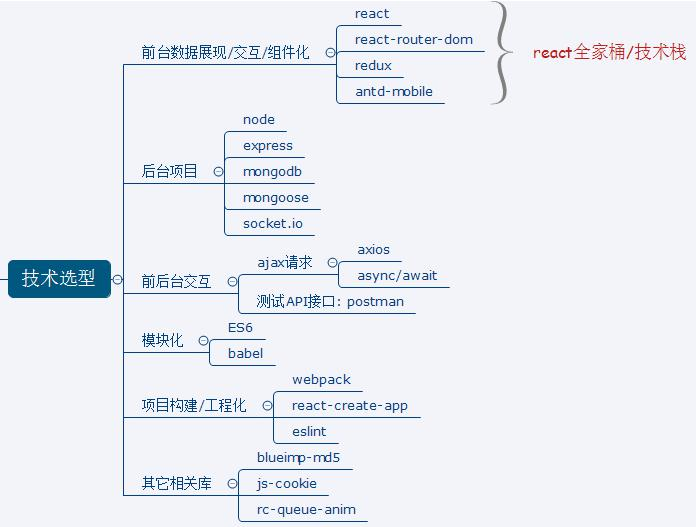


# 二、详细开发

> 我使用的是 IDEA 进行项目开发.

## 1. 使用 create-react-app(脚手架)搭建项目  

create-react-app 是 react 官方提供的用于搭建基于 react+webpack+es6 项目的脚手架.

操作:

~~~
npm install -g create-react-app : 全局下载create-react-app工具
create-react-app 项目名称 :下载模板项目
~~~


## 2. 编码测试与打包发布项目

1. 编码测试

   ~~~
   cd ggzhiping ：进入到项目目录下
   npm start  ：启动程序
   
   访问: http://localhost:3000 
   ~~~

   

2. 打包发布

   ~~~
   npm run build ：打包
   npm install -g serve  : 全局下载serve工具
   
   serve build   ：发布
   
   访问: http://localhost:5000  
   ~~~

   

## 3. 前端项目源码目录设计

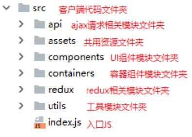


## 4. 组件库、依赖模块的下载引入

### 4.1引入 fastclick.js 解决移动端点击延迟问题

1. 下载依赖模块

   ~~~
   npm install --save fastclick
   ~~~

2. 使用：（写在全局的index.js文件中，直接作用于整个项目）

   ~~~js
   import React from 'react';
   import ReactDOM from 'react-dom';
   import App from './App.js';
   
   // 引入 fastclick
   import fastclick from 'fastclick';
   
   // 解决点击事件延迟300毫秒的问题
   fastclick.attach(document.body); 
   
   ReactDOM.render(<App />,document.getElementById('root'));
   ~~~

   


### 4.2 引入 antd-mobile

1. 下载组件库包

   ~~~shell
   npm install antd-mobile --save
   ~~~

2. 入口页面 (index.html 或 模板) 相关设置：

   ~~~html
   <!DOCTYPE html>
   <html>
   <head>
     <!-- set `maximum-scale` for some compatibility issues -->
     <meta name="viewport" content="width=device-width, initial-scale=1, maximum-scale=1, minimum-scale=1, user-scalable=no" />
     <script src="https://as.alipayobjects.com/g/component/fastclick/1.0.6/fastclick.js"></script>
     <script>
       if ('addEventListener' in document) {
         document.addEventListener('DOMContentLoaded', function() {
           FastClick.attach(document.body);
         }, false);
       }
       if(!window.Promise) {
         document.writeln('<script src="https://as.alipayobjects.com/g/component/es6-promise/3.2.2/es6-promise.min.js"'+'>'+'<'+'/'+'script>');
       }
     </script>
   </head>
   <body></body>
   </html>
   ~~~


### 4.3 实现组件的按需打包

1. 下载依赖模块

   ~~~shell
   npm install --save-dev babel-plugin-import react-app-rewired
   ~~~

2. 自定义加载配置的 js 模块: config-overrides.js  （在项目的根目录下创建）

   ~~~js
   const {injectBabelPlugin} = require('react-app-rewired');
   module.exports = function override(config, env) {
   config = injectBabelPlugin(['import', {libraryName: 'antd-mobile', style: 'css'}],
   config);
   return config;
   }
   ~~~

   修改配置：package.json

   ~~~json
   "scripts": {
   "start": "react-app-rewired start",
   "build": "react-app-rewired build",
   "test": "react-app-rewired test --env=jsdom",
   "eject": "react-scripts eject"
   }
   ~~~

   > 这样修改完，执行这些运行命令时，会根据 `react-app-rewired`这个包，先去读取 `config-overrides.js`文件下的配置。
   >
   > 而只有读取这些配置，自动按需打包功能才能实现。


**可能出现的问题：** `使用react-app-rewired启动react项目报错`

报错内容如下：

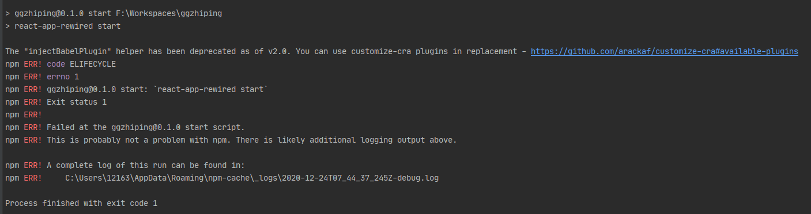

关键报错内容：

`The “injectBabelPlugin” helper has been deprecated as of v2.0`

翻译过来就是：

`自2.0版起，“injectbabelplugin”助手已被弃用`


**react-app-rewired的新版本删除了injectBabelPlugin，这些方法被移动到一个名为’customize-cra’的新包中**

**解决方法：**

把`react-app-rewired`降到2.0版本，用下面的语句删除原来的react-app-rewired：

```shell
npm uninstall react-app-rewired
```


然后重新安装低版本的react-app-rewired

```shell
npm i react-app-rewired@2.0.2-next.0
```


### 4.4 在应用中使用 antd 组件

~~~js
import React from 'react';
import ReactDOM from 'react-dom';
import registerServiceWorker from './registerServiceWorker';
// 引入antd Button组件
import {Button} from 'antd-mobile'

// 引入 fastclick
import fastclick from 'fastclick'

// 解决点击事件延迟300毫秒的问题
fastclick.attach(document.body);

ReactDOM.render(
    <Button type='primary'>学习</Button>,
  document.getElementById('root')
);

// If you want to start measuring performance in your app, pass a function
// to log results (for example: reportWebVitals(console.log))
// or send to an analytics endpoint. Learn more: https://bit.ly/CRA-vitals

registerServiceWorker();
~~~


## 5. 自定义主题颜色

1. 目的：将主体的背景颜色从 blue 变为 green  

2. 下载依赖模块  ：

   ~~~shell
   npm install --save-dev less@2.7.3 less-loader
   ~~~

3. 配置：config-overrides.js  

   ~~~js
   const {injectBabelPlugin, getLoader} = require('react-app-rewired');
   
   const fileLoaderMatcher = function (rule) {
       return rule.loader && rule.loader.indexOf(`file-loader`) != -1;
   } 
   
   module.exports = function override(config, env) {
       // babel-plugin-import
       config = injectBabelPlugin(['import', {
           libraryName: 'antd-mobile',
           //style: 'css',
           style: true, // use less for customized theme
       }], config);
       
       // customize theme
       config.module.rules[1].oneOf.unshift(
           {
               test: /\.less$/,
               use: [
                   require.resolve('style-loader'),
                   require.resolve('css-loader'),
                   {
                       loader: require.resolve('postcss-loader'),
                       options: {
                           // Necessary for external CSS imports to work
                           // https://github.com/facebookincubator/create-react-app/issues/2677
                           ident: 'postcss',
                           plugins: () => [
                               require('postcss-flexbugs-fixes'),
                               autoprefixer({
                                   browsers: [
                                       '>1%',
                                       'last 4 versions',
                                       'Firefox ESR',
                                       'not ie < 9', // React doesn't support IE8 anyway
                                   ],
                                   flexbox: 'no-2009',
                               }),
                           ],
                       },
                   },
                   {
                       loader: require.resolve('less-loader'),
                       options: {
                           // theme vars, also can use theme.js instead of this.
                           modifyVars: {
                               "@brand-primary": "#1cae82", // 正常 这里改动了主题颜色 
                               "@brand-primary-tap": "#1DA57A", // 按下 这里改动了主题颜色 
                           },
                       },
                   },
               ]
           }
       );
       
       // css-modules
       config.module.rules[1].oneOf.unshift(
           {
               test: /\.css$/,
               exclude: /node_modules|antd-mobile\.css/,
               use: [
                   require.resolve('style-loader'),
                   {
                       loader: require.resolve('css-loader'),
                       options: {
                           modules: true,
                           importLoaders: 1,
                           localIdentName: '[local]___[hash:base64:5]'
                       },
                   },
                   {
                       loader: require.resolve('postcss-loader'),
                       options: {
                           // Necessary for external CSS imports to work
                           // https://github.com/facebookincubator/create-react-app/issues/2677
                           ident: 'postcss',
                           plugins: () => [
                               require('postcss-flexbugs-fixes'),
                               autoprefixer({
                                   browsers: [
                                       '>1%',
                                       'last 4 versions',
                                       'Firefox ESR',
                                       'not ie < 9', // React doesn't support IE8 anyway
                                   ],
                                   flexbox: 'no-2009',
                               }),
                           ],
                       },
                   },
               ]
           }
       );
       
       // file-loader exclude
       let l = getLoader(config.module.rules, fileLoaderMatcher);
       l.exclude.push(/\.less$/);
       return config;
   };
   ~~~

   


## 6. 引入路由

1. 下载路由包：react-router-dom  

   ~~~shell
   npm install --save react-router-dom
   ~~~


2. 前端项目路径介绍图：

   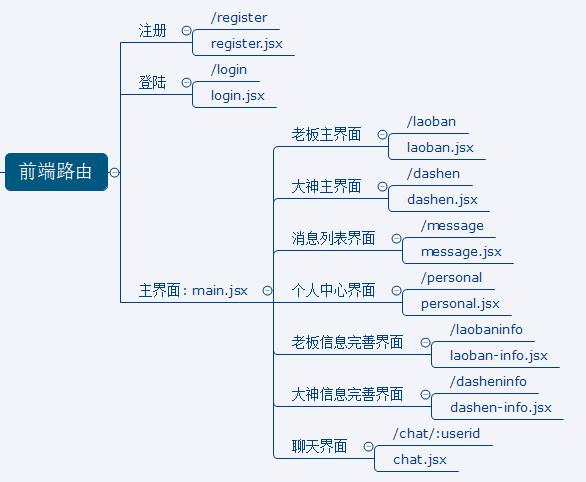


3. 自定义路由组件

   在 containers 文件夹下创建各个路由组件的文件夹，然后再创建路由组件文件，如：

   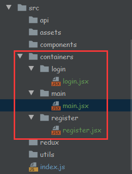

   ~~~jsx
   /**
    * 注册路由组件 register.jsx
    */
   import React ,{Component} from 'react'
   export default class  Register extends Component {
       render () {
           return (
               <div>Register</div>
           )
       }
   }
   
   /**
    * 登录路由组件 login.jsx
    */
   import React ,{Component} from 'react'
   export default class  Login extends Component {
       render () {
           return (
               <div>Login</div>
           )
       }
   }
   
   /**
    * 主界面路由组件 main.jsx
    */
   import React ,{Component} from 'react'
   export default class  Main extends Component {
       render () {
           return (
               <div>Main</div>
           )
       }
   }
   ~~~

   

4. 映射路由：index.js  

   ~~~js
   /**
    * 入口 JS
    */
   import React from 'react';
   import ReactDOM from 'react-dom';
   import registerServiceWorker from './registerServiceWorker';
   // 引入 fastclick
   import fastclick from 'fastclick'
   
   // 引入路由器里的API
   import {HashRouter,Switch,Route} from "react-router-dom";
   
   import Login from "./containers/login/login";
   import Register from "./containers/register/register";
   import Main from "./containers/main/main";
   
   // 解决点击事件延迟300毫秒的问题
   fastclick.attach(document.body);
   
   ReactDOM.render((
           <HashRouter>
               <Switch>
                   <Route path='./login' component={Login}/>
                   <Route path='./register' component={Register}/>
                   <Route component={Main}/>
               </Switch>
           </HashRouter>
       ),document.getElementById('root')
   );
   
   registerServiceWorker();
   ~~~

   


## 7. 引入 redux

1. 下载相关依赖包

   ~~~shell
   npm install --save redux@3.7.2 react-redux redux-thunk
   npm install --save-dev redux-devtools-extension
   ~~~

   > 注意: redux 不能下载最新版本  


2. 在 redux 文件夹下创建以下 js文件：

   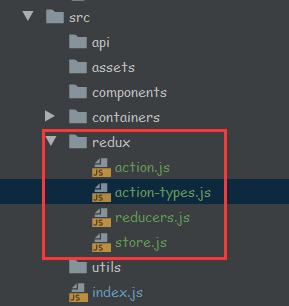

   ~~~js
   action.js
   /**
    * 包含 n个 action creator
    * 异步action
    * 同步action
    */
   --------------------------------------------------------------------
   
   action-types.js
   /**
    * 包含 n个 action type 名称常量
    */
   --------------------------------------------------------------------
   
   reducers.js
   /**
    * 包含 n 个 reducer函数：根据 老的state 和 指定的action 返回一个新的 state
    */
   import {combineReducers} from "redux";
   
   function xxx(state=0,action) {
       return state
   }
   
   function yyy(state=0,action) {
       return state
   }
   
   export default combineReducers({
       xxx,
       yyy
   })
   //  向外暴露的结构：{ xxx: 0, yyy: 0 }
   --------------------------------------------------------------------
   
   store.js
   /**
    * redux 最核心的管理对象模块
    */
   import {applyMiddleware, createStore} from "redux";
   import reducers from "./reducers";
   import thunk from "redux-thunk";
   import {composeWithDevTools} from "redux-devtools-extension";
   
   // 向外暴露store对象
   export default createStore(reducers,composeWithDevTools(applyMiddleware(thunk)))
   
   ~~~

   入口 JS：index.js

   ~~~js
   /**
    * 入口 JS
    */
   import React from 'react';
   import ReactDOM from 'react-dom';
   import registerServiceWorker from './registerServiceWorker';
   // 引入 fastclick
   import fastclick from 'fastclick'
   
   // 引入路由器里的API
   import {HashRouter,Switch,Route} from "react-router-dom";
   
   import Login from "./containers/login/login";
   import Register from "./containers/register/register";
   import Main from "./containers/main/main";
   import {Provider} from "react-redux";
   import store from "./redux/store";
   
   
   // 解决点击事件延迟300毫秒的问题
   fastclick.attach(document.body);
   
   ReactDOM.render((
       <Provider store={store}>
           <HashRouter>
               <Switch>
                   <Route path='./login' component={Login}/>
                   <Route path='./register' component={Register}/>
                   <Route component={Main}/>
               </Switch>
           </HashRouter>
       </Provider>
       ),document.getElementById('root')
   );
   
   registerServiceWorker();
   ~~~


3. 访问 localhost:3000，打开浏览器的 `开发者工具`【快捷键：f12】，

   在其菜单栏中打开 `redux`，如果是chrome浏览器，前提是 浏览器有安装`Redux DevTools`插件

   可以看到以下界面即为成功：

   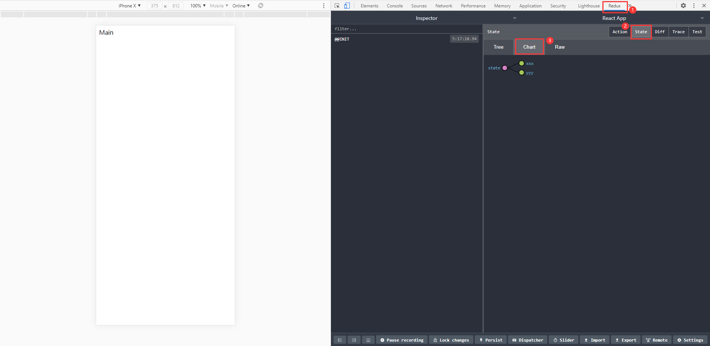


## 8. 注册/登录界面

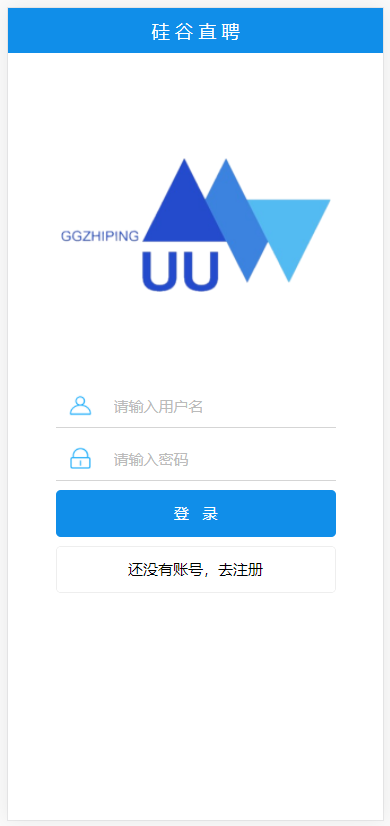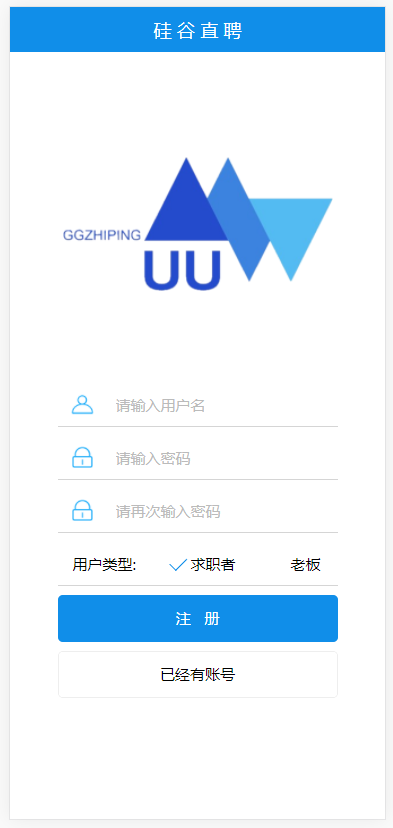


### 8.1 Logo组件

1. 引入 logo 图片到指定文件夹下【`assets/img/logo.png`】；

2. components/logo/logo.jsx

   ~~~react
   import React, {Component} from 'react'
   import logo from '../../assets/img/logo.png'
   import './logo.less'
   
   /**
    * 简单的显示Logo的组件
    */
   export default class Logo extends Component {
       render() {
           return (
               <div className="logo-container">
                   
               </div>
           )
       }
   }
   ~~~

3. components/logo/logo.less

   ~~~less
   .logo-container {
     margin: 0 auto;
     margin-top: 150px;
     margin-bottom: 80px;
     width: 100%;
     max-width: 270px;
     min-width: 170px;
   
     .logo-img {
       width: 100%;
     }
   }
   ~~~


### 8.2 注册组件

containers/register/register.jsx

~~~react

~~~


containers/register/register.less

~~~less

~~~


### 8.3 登录组件

containers/login/login.jsx

~~~react

~~~


containers/login/login.less

~~~less

~~~


## 9. 搭建后台应用

### 9.1 安装 express 模块

Express模块：是基于Node.js的一个Web框架。Express很轻巧，通常用来做Web后端的开发。【`官网：http://expressjs.com/`】


直接使用 npm 命令安装即可：

~~~
npm install -g express
~~~


安装可能遇到的问题：

输入express --help或者输入express -V命令，发现输入框弹出 

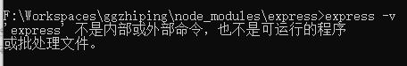


解决办法：

- 最新express版本中将命令工具分家出来了，因此还需要安装一个命令工具,命令如下:

  ~~~
  npm install -g express-generator
  ~~~

  


### 9.2 创建 node+express 应用

1. 在 IDEA 或 cmd中进到新建项目要放置的目录下，然后执行创建命令：

   ~~~
   express -e 项目名称
   ~~~

2. 虽然该目录下出现了新建的项目文件夹，但窗口也有相应警告提示：

   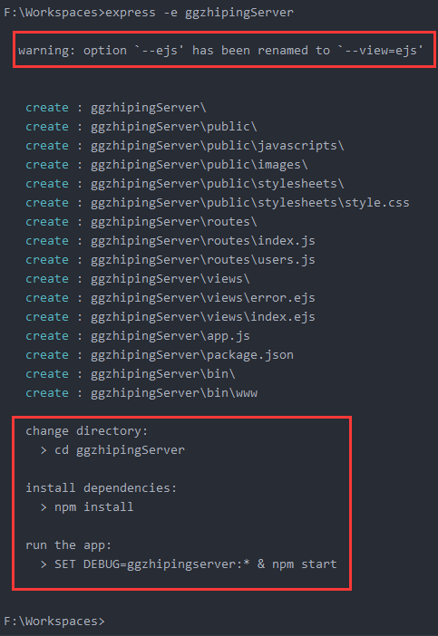

   上面的红框是警告提示，下面的红框是要我们进行的操作：

   需要 `cd 项目名称` 下，再次安装模块，最后以 `npm start` 来运行项目.

   

3. 因为 idea创建的项目启动后默认的端口号都是 3000，所以为了前后端项目同时启动不会出现端口号被占用的问题，这里选择修改后端的端口号：

   方式一：

   ​	打开 bin文件夹 ---> www文件，修改红框里的端口号即可.

   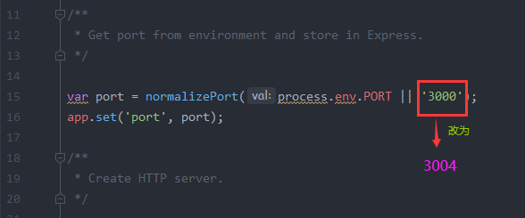

   方式二：

   ​	打开 app.js文件，在下面红框上下文位置，添加红框里的代码即可.

   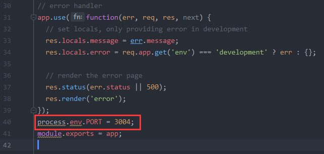

   

4. 启动运行：

   - 执行命令：`npm start`
   - 在浏览器地址栏输入：http://localhost:3004/，显示下面页面即为成功.

   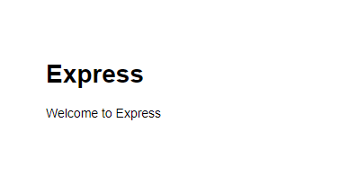


### 9.3 后台应用结构

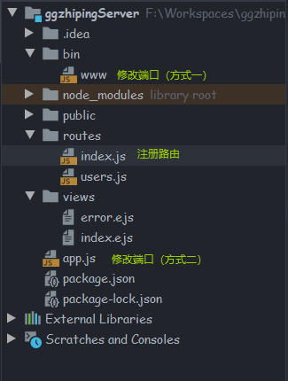


### 9.4 后台简单编码并测试

#### 9.4.1 后台项目操作

1. 需求：

   - 后台应用运行端口指定为 3004
   - 提供一个用户注册的接口
     - path 为: /register
     - 请求方式为: POST
     - 接收 username 和 password 参数
     - admin 是已注册用户
     - 注册成功返回: {code: 0, data: {_id: 'abc', username: ‘xxx’, password:’123’}、
     - 注册失败返回: {code: 1, msg: '此用户已存在'}

2. 修改端口号: bin/www 

   ~~~js
   var port = normalizePort(process.env.PORT || '3004');
   ~~~

3. 注册新路由: routes/index.js  

   在该文件倒数第二行添加以下代码【即在 `module.exports = router;` 之前】：

   ~~~js
   router.post('/register', function (req, res, next) {
       const {username, password} = req.body
       console.log('register', username, password)
       if (username === 'admin') {
           res.send({code: 1, msg: '此用户已存在'})
       } else {
           res.send({code: 0, data: {_id: 'abc', username, password}})
       }
   })
   ~~~

4. 重启应用：`npm start  `


#### 9.4.2 使用 postman 测试接口  

1. 双击打开 postman，点击左边菜单栏的 `Collections`  --->  `+ New Collection`

   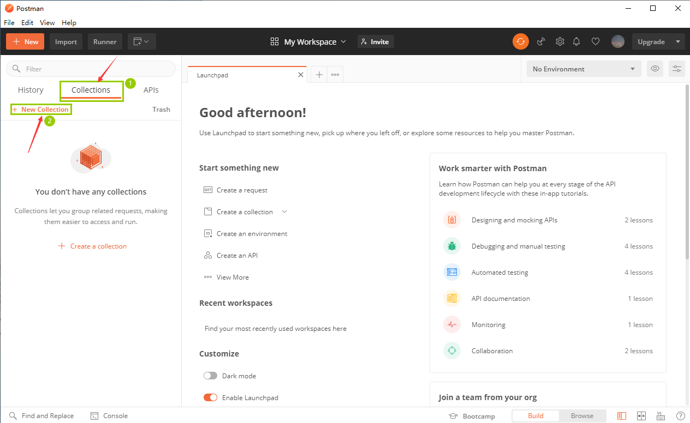


2. 输入新建的 collection的名称，点击 `Create`.

   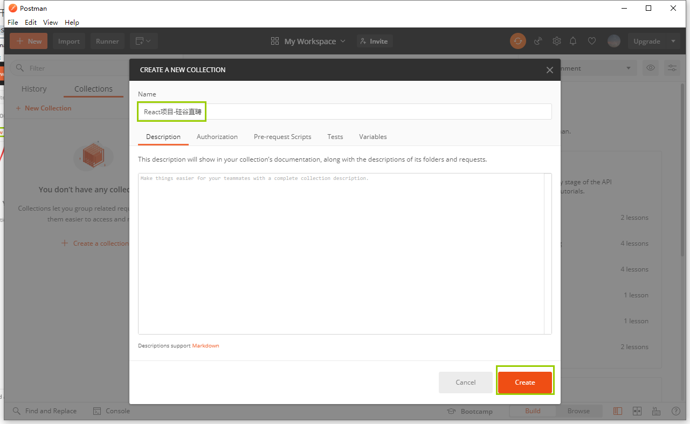


3. 点击右边的 “+”号，新建一个request请求.

   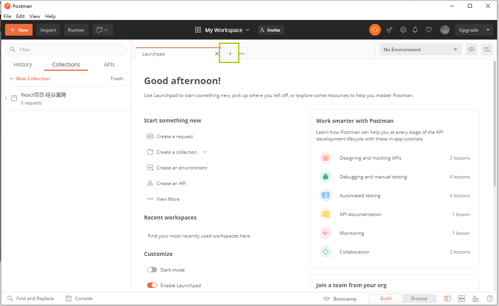

   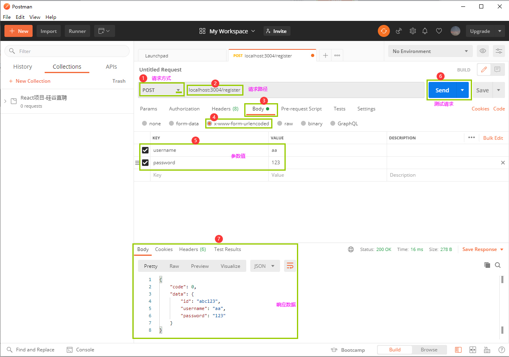

   > postman中 form-data、x-www-form-urlencoded、raw、binary的区别，参考文章：http://blog.csdn.net/wangjun5159/article/details/47781443


4. 保存请求接口记录

   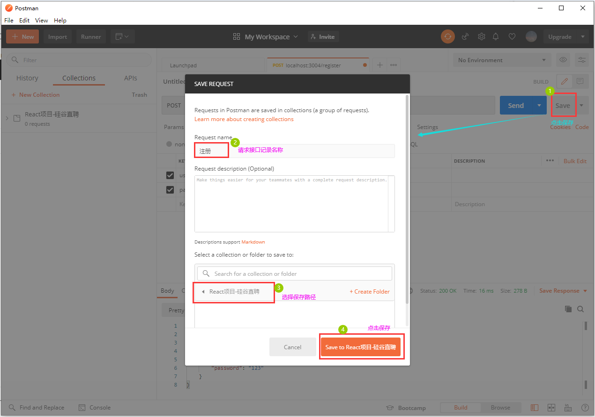

   按上图操作完之后就能在左边列表框的 “React项目-硅谷直聘”文件夹下看到多出一个 “注册”请求接口记录。


### 9.5 后台自动重运行

问题：每次修改后台应用代码，需要重新运行命令修改才生效。

解决: 使用 nodemon 包

下载：`npm install --save-dev nodemon`

配置：在  package.json文件中修改 `"start": "node ./bin/www"` 这行代码，改为 `"start": "nodemon ./bin/www"`

​		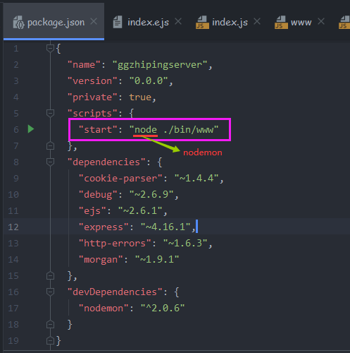

测试：修改后台任何代码，会自动重新运行最新的代码 (按下 ctrl + S)  


### 9.6 使用 mongoose 操作数据库

#### 9.6.1 安装 MongoDB

安装包下载地址：https://link.csdn.net/?target=https%3A%2F%2Fwww.mongodb.com%2Fdownload-center%2Fcommunity

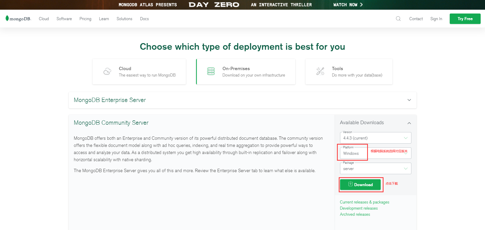


下载完后双击打开开始安装，具体安装教程可以自己百度搜【https://www.runoob.com/mongodb/mongodb-window-install.html】，这里就不详细展开了。


**连接MongoDB**

我们可以在命令窗口中运行 mongo.exe 命令即可连接上 MongoDB，执行如下命令：

```
C:\mongodb\bin\mongo.exe
```

> 注意：执行完后不要关闭命令行窗口，除非当你不在需要用到mongodb时再关掉。


#### 9.6.2 IDEA中安装Mongoose依赖

下载依赖包：`npm install --save mongoose`

> 还用到了加密工具：`npm install blueimp-md5`


#### 9.6.3 编写测试文件

db/db_test.js  

~~~java

~~~


#### 9.6.4 安装与使用 mongodb插件：Mongo Plugin

**安装教程：**

1. 点击菜单栏上的 `File` ---》 `Settings` ---》`Plugins` ---》`Marketplace` ---》在搜索框内输入`Mongo Plugin` 查找

   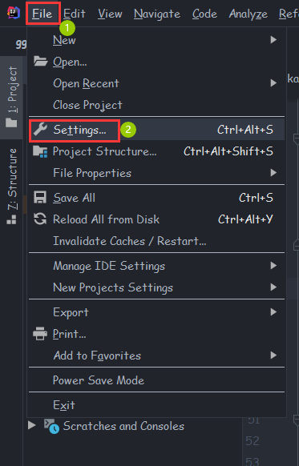

   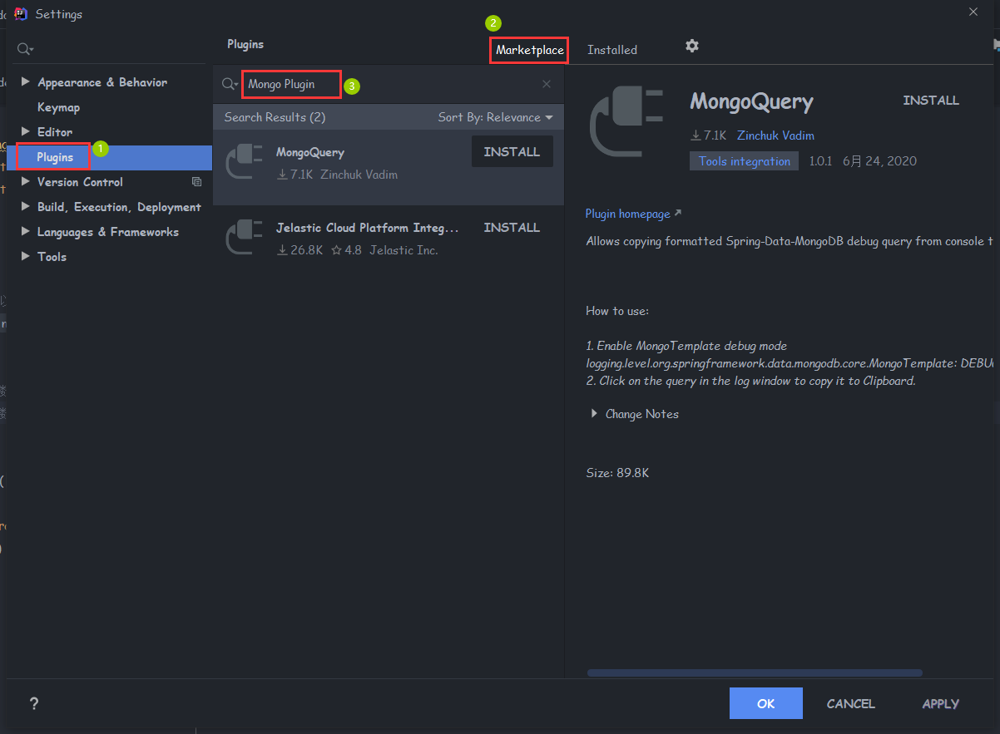


2. 如果能查找到，则直接点击右边的 `INSTALL`进行安装；

3. 若不能找到，到其官网直接下载安装包：https://plugins.jetbrains.com/plugin/7141-mongo-plugin/versions

   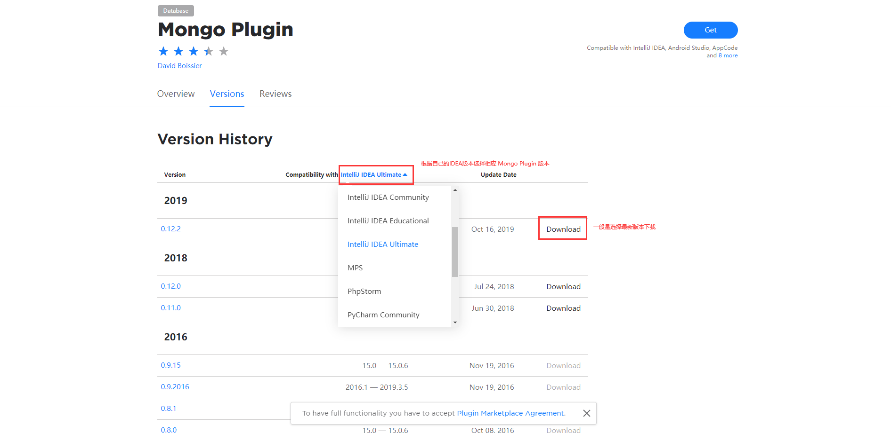


4. 然后在IDEA中点击 如下图一样的图标，选择 `Install Plugin from Disk...` ，选择刚下载的安装包位置，即可安装成功。

   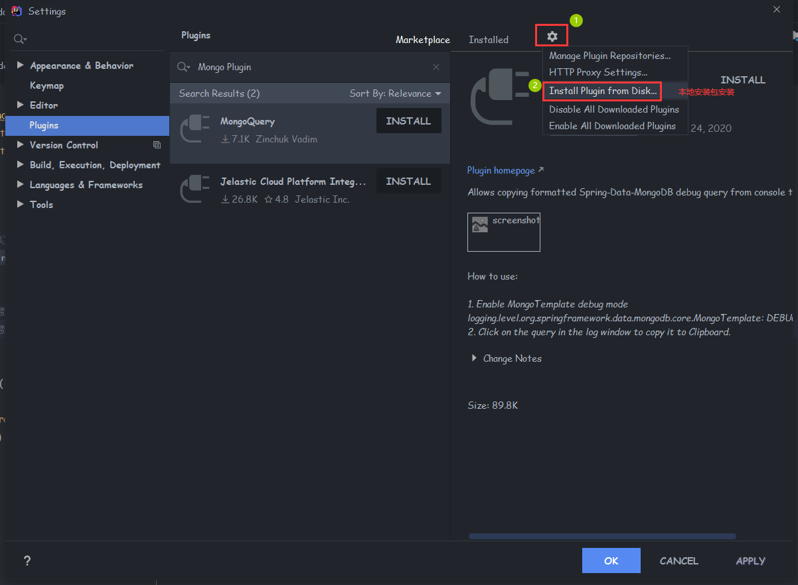


**使用教程：**

1. 安装成功后要重启IDEA，然后在最右边工具栏可以看到 `Mongo Explore`，然后如下图操作：

   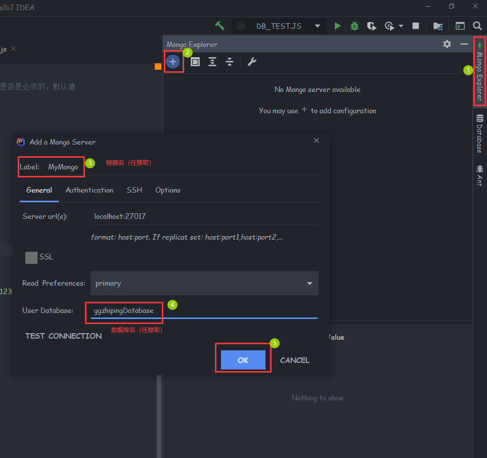


